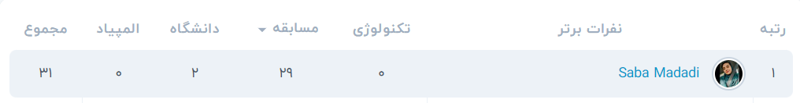

#### All codes have received a perfect score of 100 out of 100! (Just for additional programming practice!)

  

<table>
    <tr>
      <td> فاکتوریل </td>
      <td><a href="https://quera.org/problemset/589/"> Q </a></td>
      <td><a href="Factorial.py"> A </a></td>
    </tr>
    <tr>
      <td> توان دو </td>
      <td><a href="https://quera.org/problemset/616/"> Q </a></td>
      <td><a href="Power of 2.py"> A </a></td>
    </tr>
  <tr>
      <td> روز آزادی بیان در برره </td>
      <td><a href="https://quera.org/problemset/10162/"> Q </a></td>
      <td><a href="Freedom of Speech Day in Barareh.py"> A </a></td>
    </tr>
  <tr>
      <td> !!خر در چمن فراوونه </td>
      <td><a href="https://quera.org/problemset/8838/"> Q </a></td>
      <td><a href="There is a Donkey in the Lush Grass!!.py"> A </a></td>
    </tr>
  <tr>
      <td> جدول ضرب گنده </td>
      <td><a href="https://quera.org/problemset/3409/"> Q </a></td>
      <td><a href="Massive Multiplication Table.py"> A </a></td>
    </tr>
   <tr>
      <td> شطرنج حرفه ای </td>
      <td><a href="https://quera.org/problemset/2636/"> Q </a></td>
      <td><a href="Professional Chess.py"> A </a></td>
    </tr>
   <tr>
      <td> تک رقمی </td>
      <td><a href="https://quera.org/problemset/3539/"> Q </a></td>
      <td><a href="One-digit.py"> A </a></td>
    </tr>
    <tr>
      <td> هندونه‌خوری </td>
      <td><a href="https://quera.org/problemset/35253/"> Q </a></td>
      <td><a href="Watermelon-eating.py"> A </a></td>
    </tr>
    <tr>
      <td> سوال برنامه نویسی برنامه نویسی سوال </td>
      <td><a href="https://quera.org/problemset/3408/"> Q </a></td>
      <td><a href="Programming Question Question Programming.py"> A </a></td>
    </tr>
    <tr>
      <td> سوال نفس‌گیر </td>
      <td><a href="https://quera.org/problemset/26651/"> Q </a></td>
      <td><a href="Breath-taking Question.py"> A </a></td>
    </tr>
    <tr>
      <td> تست بینایی </td>
      <td><a href="https://quera.org/problemset/2659/"> Q </a></td>
      <td><a href="Vision Test.py"> A </a></td>
    </tr>
    <tr>
      <td> !آخ جون طرف نیست </td>
      <td><a href="https://quera.org/problemset/3538/"> Q </a></td>
      <td><a href="Akh Joon the Person Is Not Available!.py"> A </a></td>
    </tr>
    <tr>
      <td> جمع بزرگان </td>
      <td><a href="https://quera.org/problemset/2551/"> Q </a></td>
      <td><a href="The Sum of the Elders.py"> A </a></td>
    </tr>
    <tr>
      <td> یک ساعت </td>
      <td><a href="https://quera.org/problemset/2886/"> Q </a></td>
      <td><a href="One Hour.py"> A </a></td>
    </tr>
    <tr>
      <td> ام‌سین </td>
      <td><a href="https://quera.org/problemset/28947/"> Q </a></td>
      <td><a href="M S.py"> A </a></td>
    </tr>
    <tr>
      <td> بازی </td>
      <td><a href="https://quera.org/problemset/52543/"> Q </a></td>
      <td><a href="One-digit.py"> A </a></td>
    </tr>
    <tr>
      <td> مقسوم‌علیه‌های دردسرساز </td>
      <td><a href="https://quera.org/problemset/33045/"> Q </a></td>
      <td><a href="One-digit.py"> A </a></td>
    </tr>
    <tr>
      <td> جاده کشی </td>
      <td><a href="https://quera.org/problemset/2637/"> Q </a></td>
      <td><a href="One-digit.py"> A </a></td>
    </tr>
    <tr>
      <td> لکنت </td>
      <td><a href="https://quera.org/problemset/2530/"> Q </a></td>
      <td><a href="One-digit.py"> A </a></td>
    </tr>
    <tr>
      <td> مسابقه‌ی آسان </td>
      <td><a href="https://quera.org/problemset/2439/"> Q </a></td>
      <td><a href="One-digit.py"> A </a></td>
    </tr>
    <tr>
      <td> شرکت‌های هرمی در برره </td>
      <td><a href="https://quera.org/problemset/10169/"> Q </a></td>
      <td><a href="One-digit.py"> A </a></td>
    </tr>
    <tr>
      <td> حدس عدد </td>
      <td><a href="https://quera.org/problemset/2596/"> Q </a></td>
      <td><a href="One-digit.py"> A </a></td>
    </tr>
    <tr>
      <td> !کم ارزشترین رقم 9 نیست </td>
      <td><a href="https://quera.org/problemset/3411/"> Q </a></td>
      <td><a href="The Least Significant Digit Is Not 9.py"> A </a></td>
    </tr>
    <tr>
      <td> چیدمان </td>
      <td><a href="https://quera.org/problemset/2534/"> Q </a></td>
      <td><a href="Arrangement.py"> A </a></td>
    </tr>
    <tr>
      <td> دایره عجیب </td>
      <td><a href="https://quera.org/problemset/34081/"> Q </a></td>
      <td><a href="Strange Circle.py"> A </a></td>
    </tr>
    <tr>
      <td> زینی </td>
      <td><a href="https://quera.org/problemset/33023/"> Q </a></td>
      <td><a href="Periodic.py"> A </a></td>
    </tr>
    <tr>
      <td> محاسبه </td>
      <td><a href="https://quera.org/problemset/52545/"> Q </a></td>
      <td><a href="Calculation.py"> A </a></td>
    </tr>
    <tr>
      <td> رمز </td>
      <td><a href="https://quera.org/problemset/17902/"> Q </a></td>
      <td><a href="Code.py"> A </a></td>
    </tr>
    <tr>
      <td> رامین و مسئله‌ی ریاضی </td>
      <td><a href="https://quera.org/problemset/102261/"> Q </a></td>
      <td><a href="Ramin & the Math Problem.py"> A </a></td>
    </tr>
    <tr>
      <td> مستطیل بد </td>
      <td><a href="https://quera.org/problemset/3541/"> Q </a></td>
      <td><a href="Parallelogram.py"> A </a></td>
    </tr>
    <tr>
      <td> صدف فلزی </td>
      <td><a href="https://quera.org/problemset/6581/"> Q </a></td>
      <td><a href="Metallic Shell.py"> A </a></td>
    </tr>
</table>
